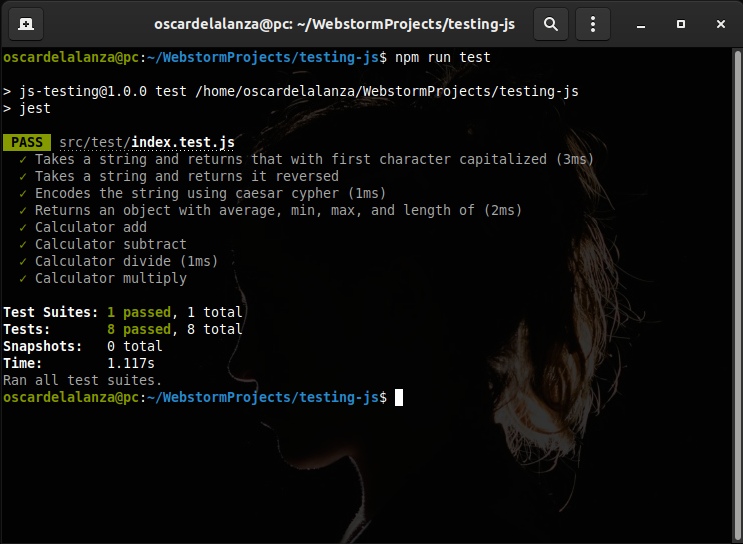

# Testing JavaScript practice

The only way to get comfortable with js testing is to spend some time doing it. So this project consists of implementing 5 functions and tests for them.

you can find the original description in [The Odin Project](https://www.theodinproject.com/courses/javascript/lessons/testing-practice)

## Built With

- Javascript, HTML, CSS
- JEST

## Getting Started

This is a testing practice project of the following:

- `Capitalize(string)` takes a string and returns that string with the first character capitalized.

- `ReverseString(string)` takes a string and returns it reversed.

- A `calculator` object that contains the basic operations: `add`, `subtract`, `divide`, and `multiply`.

- Caesar Cipher. [Read about it on this website](http://practicalcryptography.com/ciphers/caesar-cipher)

- Array Analysis. Write a function that takes an array of numbers and returns an object with the following properties:
 `average`, `min`, `max`, and `length`.

> To get a local copy up and running follow these simple example steps.
 
### Prerequisites

- `npm`
- `git`

### Setup

To clone the project into your local environment do the following

- open a new `terminal` window and navigate to the directory where the project will be stored
- run the command `git clone git@github.com:oscardelalanza/testing-js.git`
- run the command `cd testing-js` to enter to the project directory

### Install

To install the requires packages do the following

- inside `testing-js` directory run the command `npm install`

### Run tests

- run the command `npm run test`

## Authors

👤 **Oscar De La Lanza**

- Github: [@oscardelalanza](https://github.com/oscardelalanza)
- Twitter: [@oscardelalanza](https://twitter.com/oscardelalanza)
- Linkedin: [Oscar De La Lanza](https://www.linkedin.com/in/oscardelalanza/)
- Email: oscardelalanza@gmail.com

👤 **Mark Baidebura**

- Github: [@webmarkyn](https://github.com/webmarkyn)

## 🤝 Contributing

Contributions, issues and feature requests are welcome!

Feel free to check the [issues page](https://github.com/webmarkyn/testing-js/issues).

## Show your support

Give a ⭐️ if you like this project!
